# GirlsCARE Website

The website for **GirlsCARE**, a feminist-led climate justice organisation based
in Jamaica, championing gender-responsive climate justice across the Caribbean.
It introduces the organisation, its programmes, community stories, resources,
and ways to get involved.

Built with **HTML, CSS, and vanilla JavaScript**, served directly from `public/`
with **Firebase Hosting**. There is no application build step, package install,
database, or custom backend required to run the site locally.

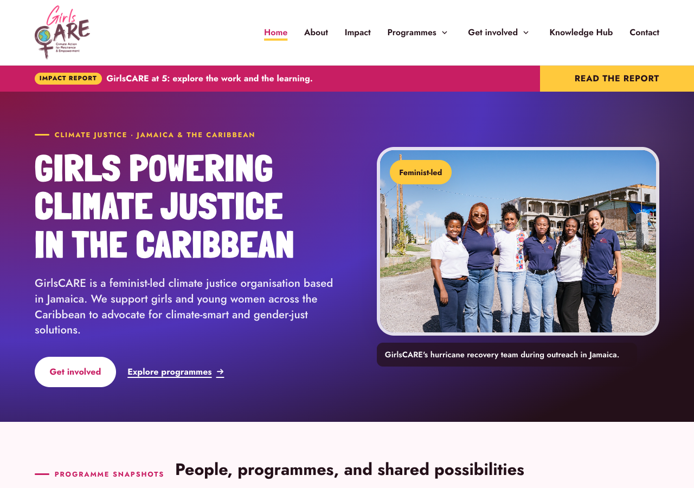

[Quick start](#quick-start) |
[Pages and features](#pages-and-features) |
[Screenshots](#screenshots) |
[Project structure](#project-structure) |
[Content maintenance](#content-and-media-maintenance) |
[Deployment](#firebase-hosting)

## Quick start

You need Git, Python 3, and a modern browser for local development.

```sh
git clone https://github.com/daryn-brown/girlscare-website.git
cd girlscare-website
python3 -m http.server 4173 --bind 127.0.0.1 --directory public
```

Open **http://127.0.0.1:4173/**. Stop the server with `Ctrl+C`.

Already have the repository? Run the server command from its root directory.
Edit the HTML, CSS, or JavaScript and reload the browser; no compilation is needed.

Serve **`public/` as the web root**, rather than opening HTML with `file://`.
Programme pages use root-relative asset and navigation paths, which need an HTTP
server to resolve consistently.

## Pages and features

| Page | Route | What it contains |
|---|---|---|
| [Home](public/index.html) | `/` | Organisation introduction, programme summaries, people, activity gallery, impact preview, and participation links. |
| [About](public/about.html) | `/about.html` | Identity, six grounding principles, five expanded values, eight approach principles, team introductions, and five future priorities. |
| [Mentorship](public/programmes/mentorship.html) | `/programmes/mentorship.html` | The flagship Young Women's Climate Justice Mentorship Programme, audience, approach, historical cohort context, outcomes, and resources. |
| [Lend a Girl a Hand](public/programmes/lend-a-girl-a-hand.html) | `/programmes/lend-a-girl-a-hand.html` | Practical support, hurricane relief, Back to School support, and connections to wider resilience work. |
| [Envisioning Resilience](public/programmes/envisioning-resilience.html) | `/programmes/envisioning-resilience.html` | Photography, visual storytelling, women's lived experience, adaptation dialogue, and programme resources. |
| [Care Collective](public/programmes/care-collective.html) | `/programmes/care-collective.html` | Collective care, sustainable leadership, shared sessions, retreat activity, and organisational wellbeing priorities. |
| [Impact](public/impact.html) | `/impact.html` | Historical cohort snapshots, nine outcome themes, three milestones, participant-story links, compact programme summaries, and scoped regional context. |
| [Knowledge Hub](public/knowledge-hub.html) | `/knowledge-hub.html` | A searchable, type-filtered library of six external resource entries and one approved participant story, with publisher context and four programme previews. |
| [Get Involved](public/get-involved.html) | `/get-involved.html` | Network, volunteer, mentor, and partnership pathways with Google Forms loaded on request inside the site. |
| [Support Our Work](public/support.html) | `/support.html` | Qualitative funding/in-kind priorities and an on-site donation-interest form. It does not process payments. |
| [Privacy and Enquiries](public/privacy.html) | `/privacy.html` | Form-provider information, submission boundaries, minimisation guidance, and the existing contact channel for questions. |
| [Not found](public/404.html) | Unmatched Hosting URLs | The not-found response used by Firebase Hosting. |

### Visitor experience

- All four programme menu entries open dedicated pages; shorter summaries remain
  on Home and Impact.
- Programme pages have in-page navigation, contextual activity photographs, and
  links to related pages and Knowledge Hub resources.
- Knowledge Hub search and type filters run in the browser, with a result count,
  clear controls, and an explicit no-results state. All resources remain readable
  without JavaScript.
- Participation links stay on the website. Google Forms load only when their
  native disclosure panels are opened, with direct new-tab links always available
  as an alternative.
- The mobile menu supports touch and keyboard interaction. Desktop submenus
  support disclosure buttons, arrow-key entry, and Escape.
- Activity-gallery captions are available through hover/focus and touch
  interaction. New programme photo sections keep captions visible.
- Semantic headings, skip links, image alternatives, visible focus, responsive
  layouts, and reduced-motion styles support accessibility.
- Essential text and links are static HTML and remain available without
  JavaScript. JavaScript enhances navigation, mobile-header behaviour, gallery
  captions, and homepage section highlighting.

### Programme distinctions

**Mentorship** is the flagship. Its historical cohort snapshots are not
cumulative reach totals or current application criteria.

**Lend a Girl a Hand** is the broader programme; hurricane relief is one part of
it, not a fifth programme. Back to School support is also represented. Wider
farming, livelihood, and geographic context is labelled as GirlsCARE-wide work.

**Envisioning Resilience** describes the Jamaica photography and storytelling
work with NAP Global Network and Lensational. Its resources distinguish the
Jamaica programme from the earlier Ghana and Kenya pilots.

**Care Collective** presents emotional, psychological, social, and material
wellbeing as part of sustainable activism and leadership. Historical sessions
and retreat examples do not establish a future schedule, open enrolment, or a
clinical service.

### Impact and evidence

Home and Impact display **15** participants in the first mentorship cohort and
**25** in a subsequent programme, explicitly labelled as historical snapshots.
These figures are not added together or presented as unique-person totals.
The **four programme areas** count matches the site's programme navigation.
The guide does not supply precise years for those two cohort examples.

Impact brings together all nine outcome themes and three milestones from the
content guide. Qualitative outcomes and organisational priorities are not
presented as measured percentage improvements or identical results for every
participant.

The full, approved Jamila Falak account has one canonical destination:
`/knowledge-hub.html#jamila-falak`. Home, Impact, and Envisioning Resilience
provide previews linking to it. The former placeholder homepage testimonial
has been removed; no new participant quote or portrait is implied.

Regional reach distinguishes historical Caribbean mentorship cohorts from
Jamaican community activities. The map is regional context only and has no
invented office or participant-location pin. Parish and country examples are
not treated as a confirmed delivery footprint for every programme.

### Knowledge Hub library

The library contains seven entries: the six supplied external resources and the
approved Jamila Falak story. It shows only populated resource types: impact
reports, programme background, press coverage, photo stories, and participant
stories. Empty collection promises and unprovided publication placeholders have
been removed.

Search matches words in the cards' titles, summaries, and publisher/programme
metadata. It is not a full-text search of externally hosted articles or reports,
and it does not send queries to a server. Search and resource-type filters work
together; clearing them restores the complete catalogue.
Without JavaScript, controls stay hidden and the full catalogue remains visible.
Fragment links use native jumps, with a non-sticky mobile header so content is
not covered by the expanded navigation.

Existing resource IDs and `#library`, `#stories`, and `#jamila-falak` links remain
stable. Following a resource fragment reveals that card even if a previous
filter would hide it. The full participant narrative stays at
`#jamila-falak`; its library card is a preview, not a second copy of the story.

To add an approved resource:

1. Add an article inside `#resource-grid` with a unique, stable `id` and a
   `data-resource-type` matching the type selector.
2. Include its title, publisher or creator, programme/scope, accurate summary,
   approved destination, and related programme link. Add a date only when known.
3. Add a new type option only when there is an approved item of that type. Update
   the initial static result count for readers without JavaScript; the enhanced
   count is calculated from the cards.
4. Keep cards visible in the source HTML. Search controls are progressively
   enabled by `knowledge-hub.js`; no CMS or publication backend is required.
5. Confirm the original resource, permissions, fragment links, search results,
   and no-JavaScript presentation before release.

### Participation and support

The five existing Google Forms were confirmed as approved and receiving
responses on 29 September 2026. Their fields and response destinations are
unchanged. The website embeds them on request rather than replacing them with
a new submission backend.

| Interest | On-site destination |
|---|---|
| Join the network | `/get-involved.html#join` |
| Volunteer or share technical expertise | `/get-involved.html#volunteer` |
| Become a mentor | `/get-involved.html#mentor` |
| Partnerships, media/storytelling, and regional networks | `/get-involved.html#partner` |
| Funding or in-kind support | `/support.html#donation-interest` |

These pathways cover the guide's mentorship, partnerships, funding, technical
expertise, storytelling/amplification, community support, and networks/solidarity
opportunities. They express interest, not guaranteed places or confirmed
recruitment windows.

`enquiries.js` sets an iframe's approved Google Forms URL only when its
`details.enquiry` panel opens. Collapsing and reopening a panel on the same page
does not reload the frame or deliberately discard entered answers. Provider
content, validation, sign-in requirements, submission, and confirmation remain
Google Forms behaviour; this website does not read responses or infer a
successful submission from an iframe loading.

Each form has a provider notice, a privacy-information link, a descriptive
iframe title, and a direct Google link opening in a new tab. Without JavaScript,
the direct links remain available and no embedded forms are loaded.

The support examples now describe areas of work rather than unverified JMD
amounts or fixed-price packages. Donation interest does not process payment,
complete a donation, issue receipts, or establish tax benefits. The existing
Instagram contact remains in use; no email address or retention period has
been invented.

`privacy.html` documents the technical enquiry flow and refers questions about
response access, retention, correction, and deletion to GirlsCARE. Account
permissions, notification settings, safeguarding/consent arrangements, and
formal privacy requirements remain the organisation's responsibility.

## Screenshots

Captured from this repository's website on **29 September 2026**. Desktop
page views use a 1280 x 900 viewport; mobile views use 390 x 1000. The Knowledge
Hub programme-preview image is a detail of its grid.

These images document the repository version. The hosted website can reflect
an earlier release until a separate Firebase deployment is approved and run.

### Organisation and resources

| About GirlsCARE | Impact and reach |
|---|---|
| 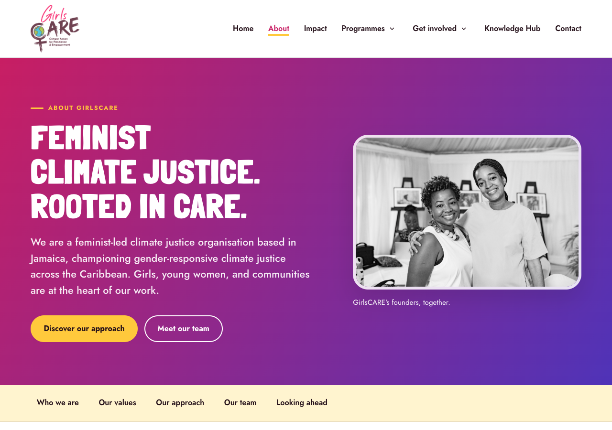 | 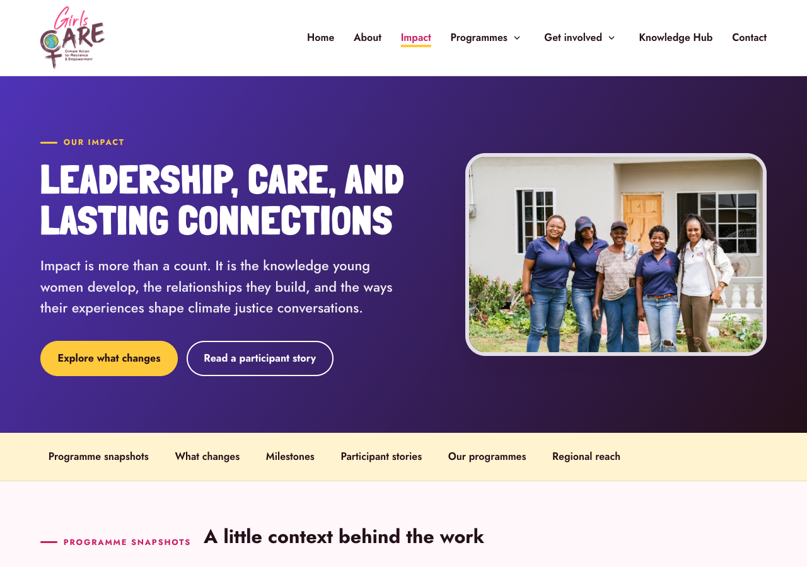 |

| Knowledge Hub library | Programme previews |
|---|---|
| 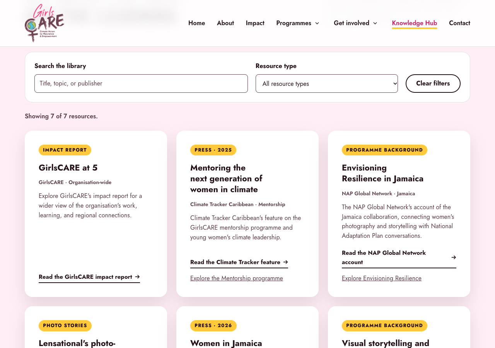 | 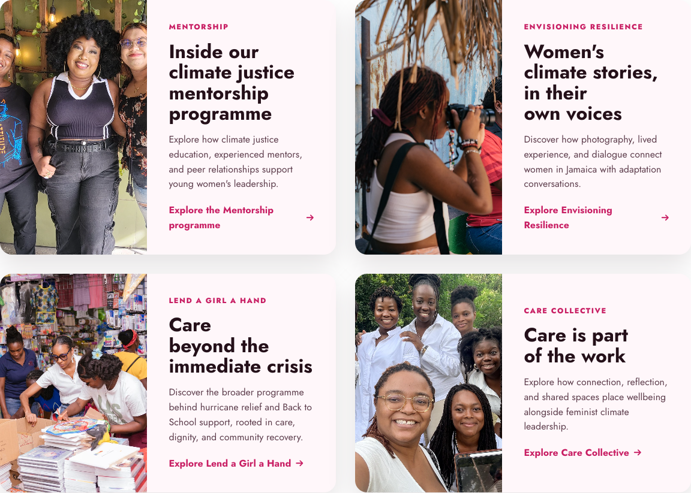 |

### Participation and support

| Get Involved | Support Our Work |
|---|---|
| 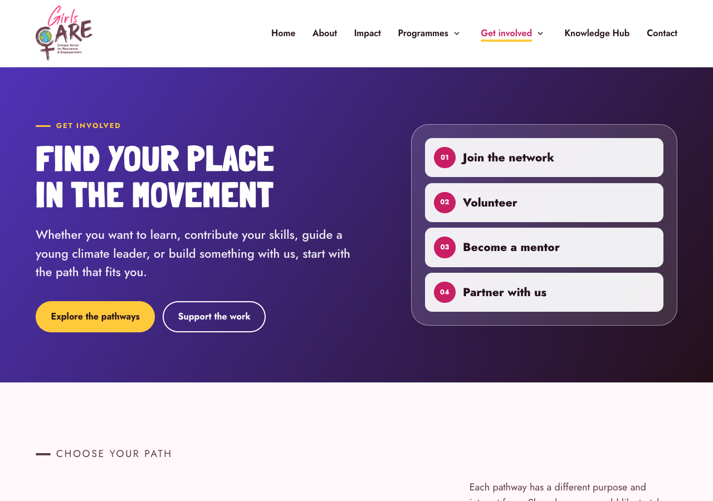 | 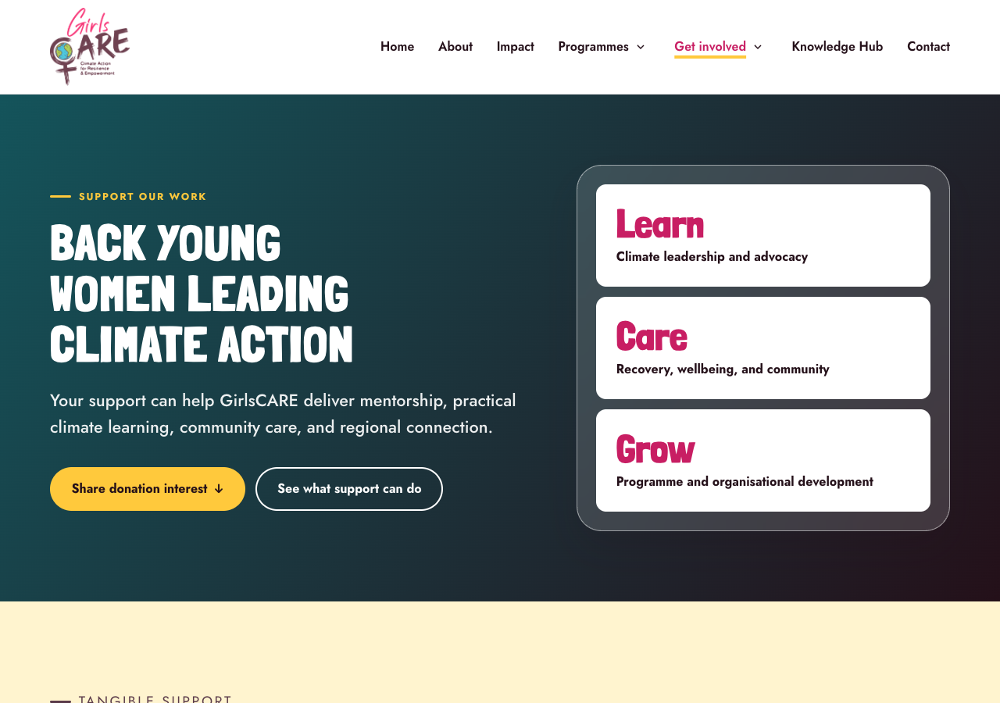 |

These screenshots show the entry pages, not private form responses. Embedded
forms are loaded only after a visitor opens a panel.

### Programme pages

| Mentorship | Lend a Girl a Hand |
|---|---|
| 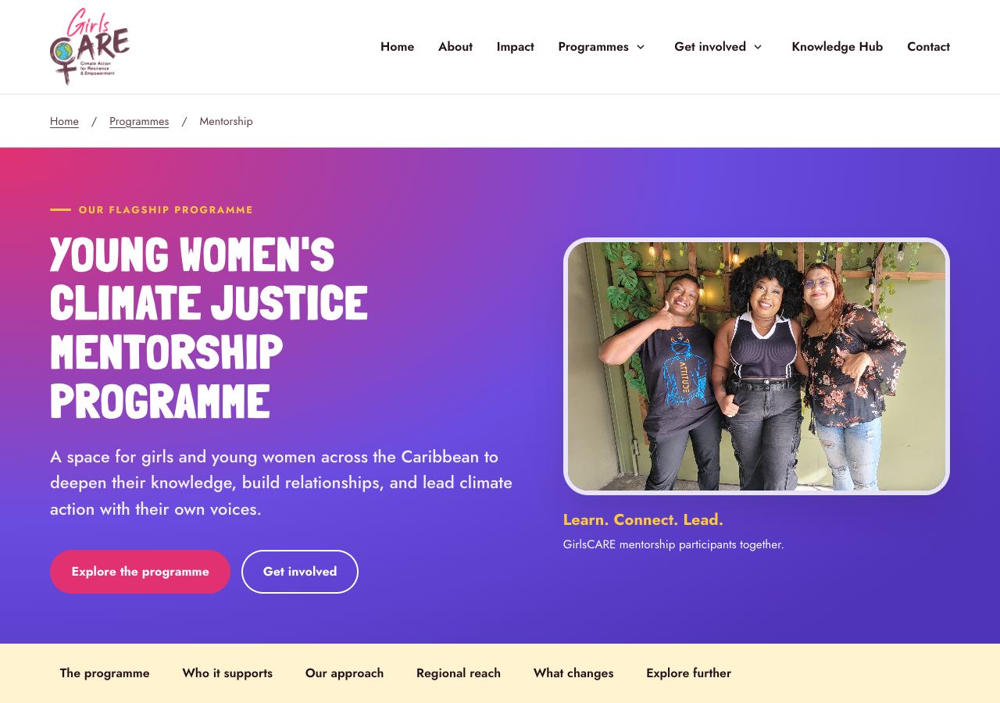 | 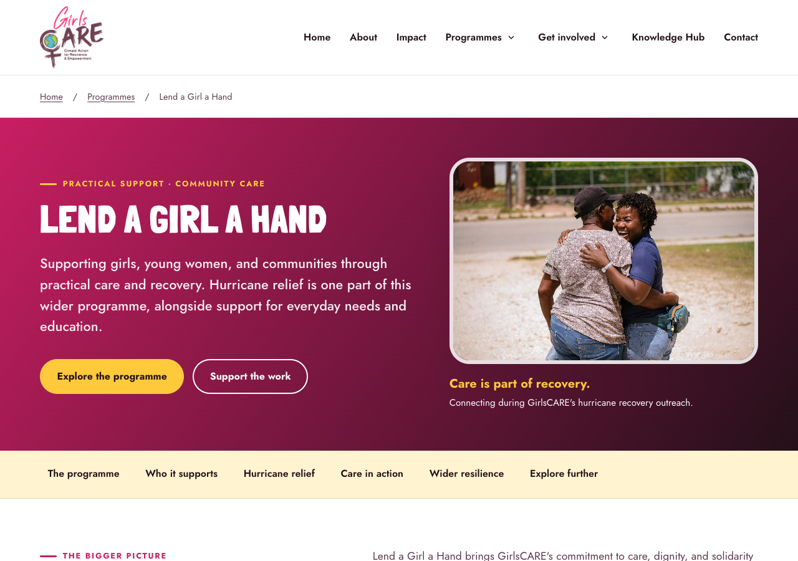 |

| Envisioning Resilience | Care Collective |
|---|---|
| 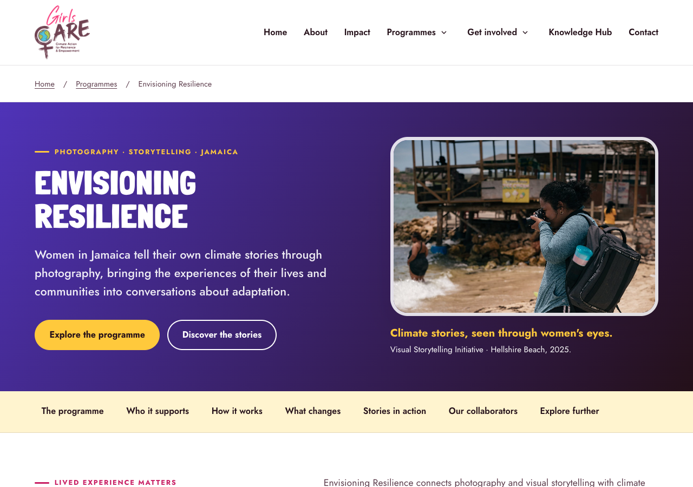 | 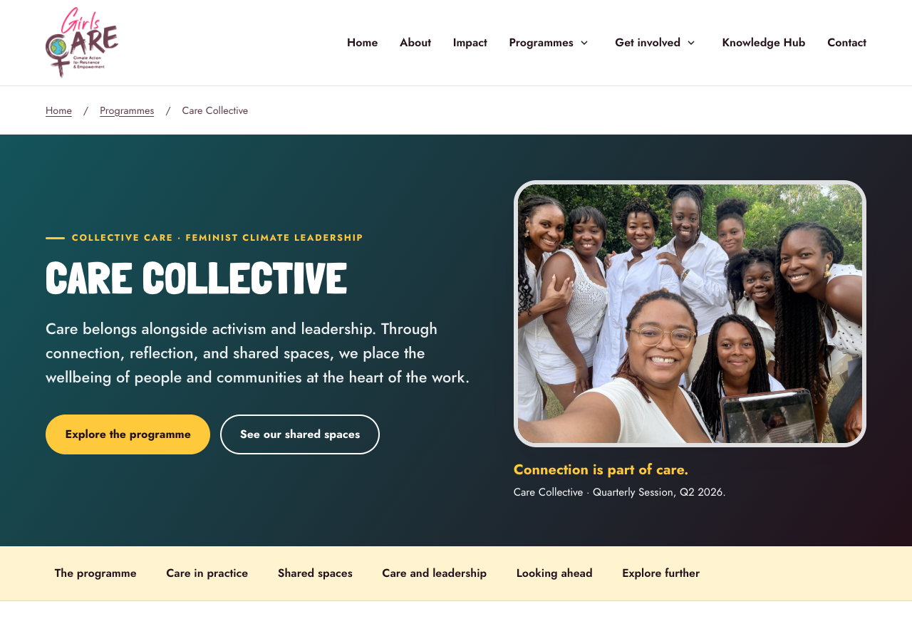 |

### Mobile views

| Home | Care Collective |
|---|---|
| 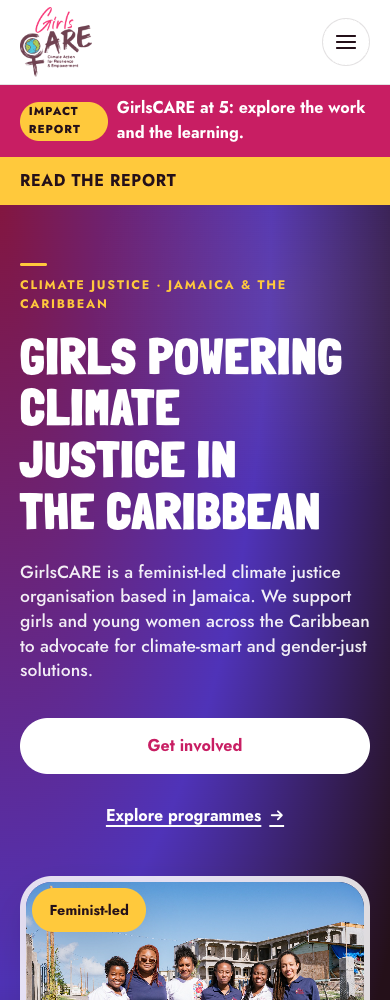 | 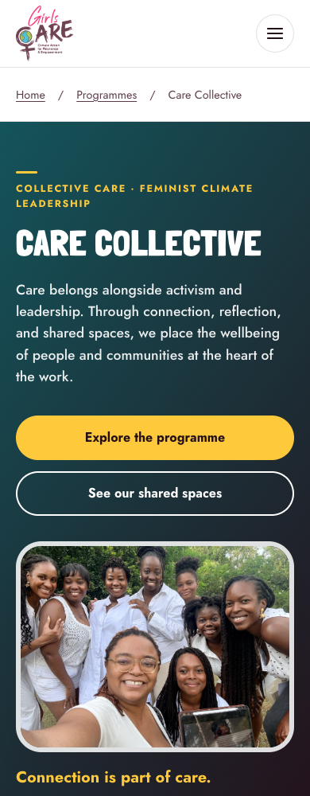 |

Screenshots live in [`docs/screenshots/`](docs/screenshots/), outside the
deployed `public/` directory. Refresh them after approved visual changes, using
the viewports above and waiting for fonts and images to load. Keep screenshots
free of private form responses, account details, and browser overlays.

## Project structure

```text
.
  README.md
  .firebaserc                 Firebase project alias
  firebase.json              Hosting root, exclusions, and cache headers
  docs/
    screenshots/             Images used by this README
  public/
    index.html               Homepage
    about.html               About GirlsCARE
    about.css                About-page styles
    impact.html              Outcomes, milestones, stories, and regional reach
    impact.css               Impact, snapshot, and participant-story styles
    knowledge-hub.html        Resources and programme previews
    knowledge-hub.css         Library layout and discovery controls
    knowledge-hub.js          Client-side search, filtering, and fragment support
    get-involved.html         Participation pathways
    support.html              Support and donation interest
    privacy.html              Enquiry-provider and privacy information
    enquiries.css             Participation, support, and privacy-page styles
    enquiries.js              On-demand Google Forms embeds
    404.html                  Hosting not-found page
    styles.css                Shared brand, layout, and responsive styles
    site.js                   Navigation and gallery enhancements
    programmes/
      mentorship.html
      lend-a-girl-a-hand.html
      envisioning-resilience.html
      care-collective.html
      programme.css          Shared long-form programme styles
    assets/
      ...                    Organisation and programme imagery
      fonts/                 Local display font and its licence
```

The site has no client-side router. Each public page is a real HTML file, and
Firebase serves those files directly. No blanket single-page-app rewrite is
configured.

## Content and media maintenance

### Editing pages

Use GirlsCARE's approved content guide and programme records as the editorial
sources. Keep public copy consistent with the organisation's feminist-led climate
justice identity and use the established programme names.

| Change | Files to review together |
|---|---|
| Shared navigation or footer | Every public content page, including the nested programme pages. There is no generated shared-template layer. |
| Programme description | Its dedicated page, the homepage card, the Impact summary, and any Knowledge Hub preview. |
| Organisation identity | About, homepage introductory copy and metadata, and the site-wide footer description. |
| Resource or publication | The canonical Knowledge Hub entry, its type/publisher metadata, the initial result count, and programme links pointing to it. |
| Shared visual behaviour | `styles.css` and `site.js`; use `about.css`, `impact.css`, `knowledge-hub.css`, `enquiries.css`, or `programmes/programme.css` for page-family-specific presentation. |
| Enquiry form | Its approved `data-src` embed URL, matching direct link, iframe title, related on-site navigation, and privacy/provider information. |
| Production domain | Canonical URLs, Open Graph URLs, social-image URLs, and the Hosting/domain configuration. |

Keep page titles, descriptions, social-preview metadata, heading hierarchy,
captions, image alternatives, and call-to-action destinations aligned with the
actual content. Do not imply that a programme is recruiting unless its current
status and participation details are confirmed.

### Preserve existing links

The following historical anchors remain useful and should not be removed
without an intentional compatibility plan:

```text
/index.html#home
/index.html#about
/index.html#programs
/index.html#blog
/index.html#coordinators
/index.html#core-team
/index.html#contact
/impact.html#mentorship
/impact.html#hurricane-relief
/impact.html#envisioning-resilience
/impact.html#care-collective
```

`/impact.html#lend-a-girl-a-hand` is also available, and the dedicated Lend a Girl
a Hand page has its own `#hurricane-relief` section. The main programme menus
should continue to link to the four dedicated pages rather than the shorter
Impact summaries.

URL fragments are handled by the browser, not sent to the server. A Hosting
redirect alone cannot distinguish two anchors on the same HTML page.

### Images, stories, and permissions

Keep original files and permission records in the organisation's internal
library. Put only approved, suitably sized web assets in `public/assets/`.
Record programme/activity, year, photographer, rights holder, permitted uses,
subject consent, caption, and alt text before publishing new material.

Use images that actually represent the named programme. Preserve creator credits
and watermarks, retain appropriate aspect ratios, and avoid crops that obscure
important people or context. Give informative images meaningful alternative
text and use visible captions where activity context matters.

The existing Q2 2026 Care Collective session, Treasure Beach retreat,
Westmoreland relief project, Back to School activity, and Envisioning Resilience
photographs retain their established programme/activity context.

The text-only Jamila Falak account was cleared for website publication during
review on 29 September 2026. That approval does not automatically cover new
portraits, quotations, or additional personal details. Do not present later
achievements as caused solely by a programme.

For reach statistics, retain the reporting period, scope, source, and counting
method. Do not add cohort figures together without confirming whether they
represent unique people or repeat programme places.

## External integrations

| Service | Current use | Maintenance considerations |
|---|---|---|
| Google Forms | Five on-request embeds for network, volunteer, mentor, partnership, and donation interest, each with a direct new-tab alternative. | Confirm ownership, questions, recipients, notifications, and privacy arrangements before changing a destination. Responses are handled by Google Forms, not by a backend in this repository. |
| OpenStreetMap | Embedded regional maps on Home and Impact. | Keep the title and geographic framing accurate. Maps are contextual, not proof of programme reach at every marked location. |
| Google Fonts | Jost body/interface typeface. | Requires an external font request; system-font fallbacks are defined. |
| Local display font | Londrina Solid Black in `public/assets/fonts/`. | Preserve its included SIL Open Font License. |
| Instagram | Existing public contact and update links. | Confirm the account and destination before changing contact details. |
| Publisher websites | Impact report, press, programme background, and photo stories. | Link and attribute rather than assuming permission to republish complete articles or media. |

The Knowledge Hub includes GirlsCARE at 5, Climate Tracker's mentorship feature,
NAP Global Network's Jamaica account, Lensational resources, Climate Home News'
2026 Jamaica feature, and IISD's Ghana/Kenya background account.

**Donation interest is not payment processing.** No payment gateway, card
collection, automated donation receipt, or tax-deductibility workflow is
implemented. Newsletter subscription and self-service content publishing are
not currently implemented either.

## Validation and contribution workflow

Work incrementally, preview each meaningful change, and obtain approval before
committing and pushing it. `main` is the integration branch for reviewed work.
Use descriptive names for any future feature branches.

There is no package-manager build, lint command, or committed automated browser
test runner. For a local review:

```sh
git diff --check
python3 -m http.server 4173 --bind 127.0.0.1 --directory public
```

- Open each affected route directly and follow its navigation, resources,
  programme cards, and footer links. Check existing anchors as well as new links.
- Review desktop, tablet, and narrow mobile widths, including 320, 375, 768,
  1024, and 1440 CSS pixels. Look for clipped text, image distortion, and
  horizontal scrolling.
- Exercise mobile menus after scrolling, keyboard focus, submenu controls,
  Escape, skip links, gallery captions, and reduced-motion preferences.
- Confirm essential information and links remain usable with JavaScript
  disabled. Check the browser console and local asset requests for errors.
- For library changes, test each resource type, combined search/type filters,
  no matches, both clear controls, and direct resource fragments after filtering.
- For enquiry changes, check that no Google Forms request occurs before a panel
  opens, that the correct form loads, that collapse/reopen does not reload it,
  and that direct links and privacy information work with JavaScript disabled.
- Check that externally hosted resources are the intended publications. Use
  approved dummy data and coordinate with the response owner if testing a form;
  do not submit unsolicited entries to live forms.
- Review image/story permissions, dates, partner names, contact details,
  metadata, and the content approval items below before a public release.

## Firebase Hosting

The configured project in [`.firebaserc`](.firebaserc) is
**`girlscarejamaica`**. Its configured primary Hosting address is
**https://girlscarejamaica.web.app/**.

**Pushing to GitHub does not deploy the website.** No GitHub Actions deployment
workflow is committed in this repository. Deployment is a separate, authorised
operation.

### Prerequisites

Use a Node.js release supported by the current Firebase CLI, with `npx`
available. Authenticate the Firebase CLI using an authorised account with
access to the configured project. Do not commit credentials, service-account
keys, or private environment files.

For local content/layout work, the Python server is sufficient. To exercise
Hosting-specific behaviour such as the custom 404 and response headers:

```sh
npx -y firebase-tools@latest emulators:start --only hosting --project girlscarejamaica
```

Use the local URL printed by the emulator. The simple Python server does not
apply `firebase.json` response headers or Firebase's custom-404 behaviour.

### Deploy a review channel

After content and asset permissions are cleared:

```sh
npx -y firebase-tools@latest hosting:channel:deploy content-review --project girlscarejamaica --expires 7d
```

This uploads the site and prints a temporary preview URL. Review that URL before
publishing to the live channel. A preview URL is not a privacy boundary; never
include confidential participant information or unapproved media.

### Deploy the live site

After explicit release approval:

```sh
npx -y firebase-tools@latest deploy --only hosting --project girlscarejamaica
```

Only `public/` is deployed. The README and its screenshots are repository
documentation, not additional website assets.

Verify the live routes, navigation, forms, resource links, image loading, and
sharing metadata after deployment. Keep the deployed commit reference and
release details. Firebase Hosting's release history can restore a previous
deployment; reverting Git alone does not roll back the hosted site.

### Caching and domains

[`firebase.json`](firebase.json) currently configures:

| Resource | Cache policy |
|---|---|
| `.html` files | `no-cache, must-revalidate` |
| `.css` and `.js` files | Public caching for 7 days |
| Matched image/icon and WOFF/WOFF2 files | Public caching for 30 days |

HTML references use versioned stylesheet/script query strings. Update the
corresponding version on every consuming page when changing shared CSS or
JavaScript. Use a new asset filename when replacing a cached image, and update
any matching social-preview metadata.

Custom-domain registration, hosting usage, and ongoing maintenance are separate
responsibilities. Domain and billing accounts should remain organisation-owned.
Verify current provider limits before adding large media libraries; do not
assume a custom domain changes hosting capacity or that exceeding a free limit
will automatically result in an acceptable upgrade.

## Content approval and remaining work

The reviewed About and four programme pages are in place, alongside the
guide-backed Impact and reach content. Other editorial and
operational work remains; the repository should not be read as approval of
every legacy claim or future service.

| Area | Outstanding review |
|---|---|
| Aggregate impact and additional testimonials | Organisation-wide totals still need verified periods, scope, sources, and counting methods. Published cohort snapshots are not cumulative totals. Additional participant stories or quotations need their own content and usage approval. |
| Founding timeline | Reconcile the guide's 2021 founding date with its separate "Since 2020" reach wording. The new About page does not invent a reconciliation. |
| Team profiles | Confirm current preferred names, roles, biographies, and affiliations. Existing coordinator profiles remain on Home. |
| Partners and funders | Review names, relationship types, destinations, and listing/logo permissions. The legacy CLF listing still needs the approved Clara Lionel Foundation correction. |
| Support costings | Published examples are qualitative. Confirm any future amounts, earmarking, or specific contribution commitments before adding them. |
| Enquiry handling | Maintain response ownership, follow-up, account permissions, notification settings, privacy/consent arrangements, and retention. The website's provider-information page does not invent those operational policies. |
| Knowledge Hub growth | Add further approved reports, blogs, mentee projects, poems, reflections, photo stories, videos, and research/advocacy resources as they become available. New media needs credits, permissions, and appropriate captions/transcripts; do not add empty collection promises. |
| Future publishing and subscriptions | Choose ownership and operating requirements before adding a CMS, newsletter service, or payment integration. |

These items should be resolved through the same feature-by-feature preview and
approval process, rather than silently inventing facts, permissions, or service
availability.

## Credits and reuse

Organisation copy and programme imagery are supplied for GirlsCARE's website.
Their presence in this repository does not imply unrestricted permission to
reuse participant photographs, stories, logos, or third-party publications.

Londrina Solid Black is by Marcelo Magalhaes and is distributed with its
[SIL Open Font License 1.1](public/assets/fonts/londrina-solid-OFL.txt).
No repository-wide software licence is currently included; confirm reuse
permissions with the maintainers.
